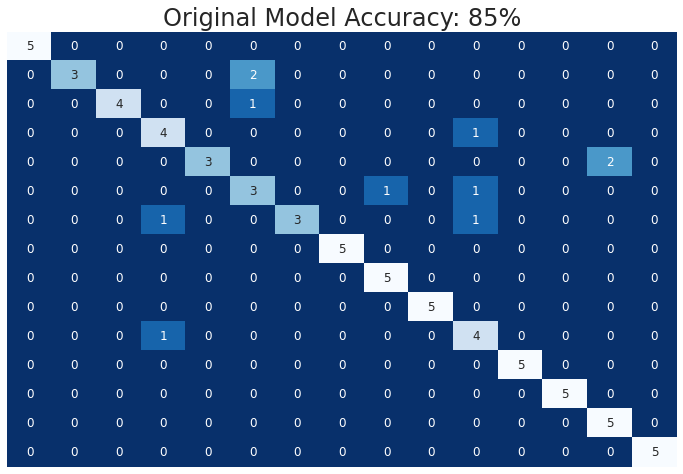
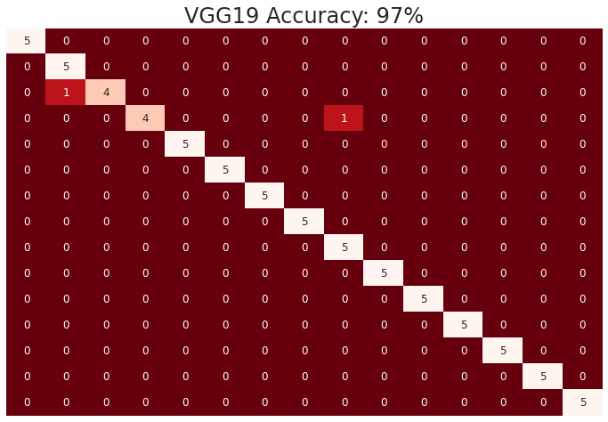
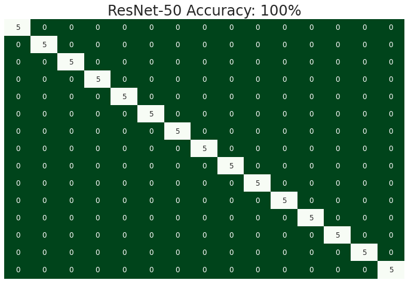

# Bird Species Classification - Convolutional Neural Nets
See the full code [here](notebook.ipynb)  
Presentation date: Aug 3, 2022  
Collaborators: [Zeinab Zeinab Masoomikhanghah](https://github.com/zmasoomi), [Mark-Anthony Recto](https://github.com/markrecto)

In this group project, we looked at applying convolutional neural networks to classification of bird species. We used [this](https://www.kaggle.com/gpiosenka/100-bird-species) dataset from Kaggle and limited the training to 15 specific bird species. 

### Model Designs

- Naive CNN
    - Three convolutional layers with increasing filter counts
    - 3x3 Kernel size
    - Maxpooling (2x2) layers between convolutional layers
    - Flatten layer
    - Fully connected layer
    - Output layer
- Transfer learning with VGG19
    - Frozen layers with weights from training on the imagenet dataset
    - Preprocessing with VGG specific Keras preprocessing module
    - Global average pooling on output from VGG layers
    - Output layer

- Transfer learning with ResNet50
    - Frozen layers with weights from training on the imagenet dataset
    - Preprocessing with ResNet specific preprocessing module
    - Global average pooling on output from ResNet layers
    - Output layer
    
    
### Preprocessing and Data Augmentation
- Augmentation methods
    - Shearing
    - Rotation
    - Zooming
    - Height/Width shifting
    - Horizontal flipping
- Preprocessing
    - Original size preserved
    - Three channel colour preserved
    - Batch size: 32
    - Values scaled to 0-1
    - Model specific preprocessing applied for transfer learning models

### Conclusions

Naive CNN approach (25 epochs, training time ~13min with Colab GPU), not based on any particular model architecture, achieved 85% overall accuracy on the reserved test set (N=75). 

Heatmap of the confusion matrix  

Transfer approaches were significantly better. VGG19 trained in 10 epochs in ~8 minutes and achieved 97% accuracy on the test set. ResNet50 performed even better, with 5 epochs trained in ~4 minutes and a 100% accuracy on the test set. 

Heatmap of VGG19 confusion matrix  

Heatmap of ResNet50 confusion matrix  

